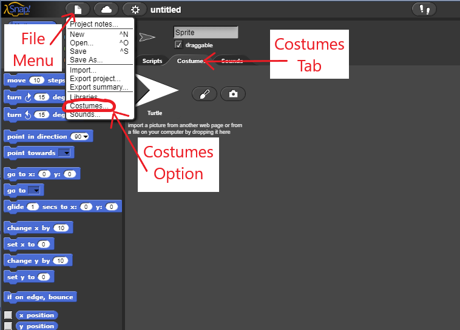
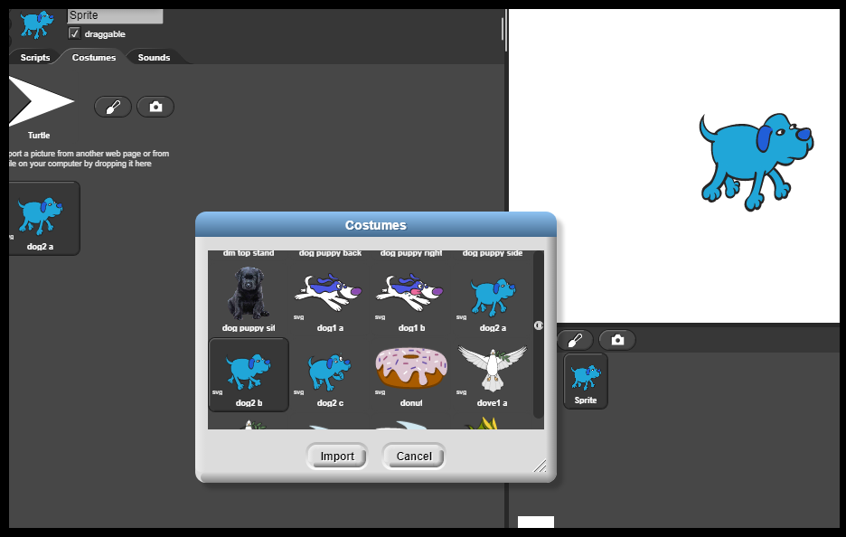

<!--- REVISED -->
# Lab 1.4: Sprites in Action

In this lab, you will use costumes and movement to create simple SNAP animations. You will also use broadcast and receive blocks to trigger actions in sprites.

Be sure to label each section of code with the problem number and a short explanation of what that section of code does.  

## Minimum Viable Product: Walking the dog

1a) In a SNAP project, click on the Costumes tab. Then, click on the file menu and choose the "Costumes" option. 

||

1b) Import the costumes "dog2-a" and "dog2-b".

2) Add code so that the sprite changes to the next costume each time the left arrow key is pressed. 

3) Add code so that the sprite does the following when you press the left arrow key:
  - Faces to the left
  - Moves 10 steps forward 
  > *Hint: The rotation buttons in the Costumes tab toolbar can be used to control how a sprite rotates!

4) Add code so that if the dog reaches the edge of the stage, it bounces.
  >*Hint: You will need one of the blocks in the "Motion" category for this!

5) Right click on the script you created and choose the "Duplicate" option. This should create a second script that is identical to the script you created in step #2-5.

6) Modify the new script so the sprite faces right and moves to the right when you press the right arrow key.

## Version 1: Talking to Fido

7) Create a new sprite. Place the new sprite in the top, left corner of the Stage.

8) Following the same steps as in part 1a and 1b, import the costume "avery b." 

9) Add code so that if you press the space bar, Avery and the dog have a conversation. Use the dialogue below:

Avery: Come here, Fido!
Fido: Woof!
Avery: Who's a good boy?
Fido: Woof!
  >*Hint: You can use the "broadcast and wait" block and the "receive" block to create conversations between sprites! See page 8 of the [SNAP Reference Manual](https://snap.berkeley.edu/snapsource/help/SnapManual.pdf) for an explanation and example of how to do this.*
  
## Version 2: Fido obeys commands

10) Modify your code so that Fido obeys Avery's command to "Come here." Right after Avery says this, Fido should turn toward Avery and move from wherever he is on the stage to a position in front of Avery.  
  >*Hint: For now, Fido should glide to this position in 1 or 2 seconds.  However, if you finish early and want an extra challenge, add code so that Fido performs an animated walk while moving to the position in front of Avery.*

11) Think of another command to give Fido.  Add code so that Fido obeys that command.

## Version 3: Fido chases the ball

12) Create a new sprite. Import one of the ball costumes. 

13) Add code so that when you press the "r" key, the ball goes to a random position on the stage.

14) Add code so that when you press the "m" key, the ball goes to the position of the mouse pointer.

15) Add code so that Fido glides or walks to the same position as the ball each time it moves.

16) Create a new animation for this project, or start a new one! Be sure all of the required steps for this lab are still visible and labeled with a comment.
